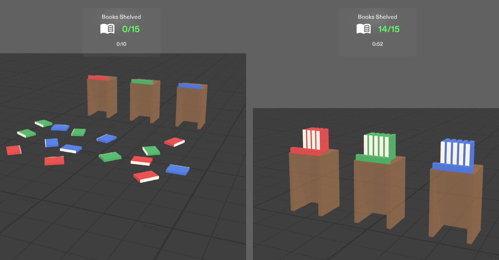

# Library Organizer

An interactive organizing game designed as a warm-up routine for real-world focus. The Lens scatters 15 color-coded books across your floor that you physically pick up and sort into their matching colored bookshelves.

By translating the satisfying act of tidying up into a short ritual, it helps users clear physical clutter, build momentum, and get mentally ready to tackle everyday productivity tasks.
